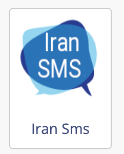
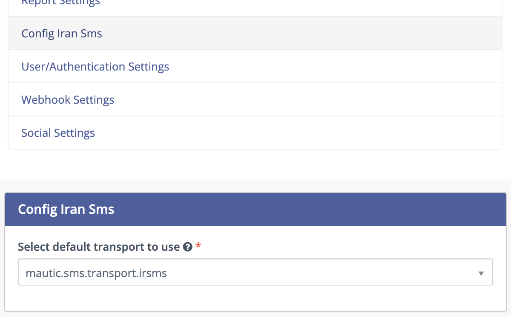
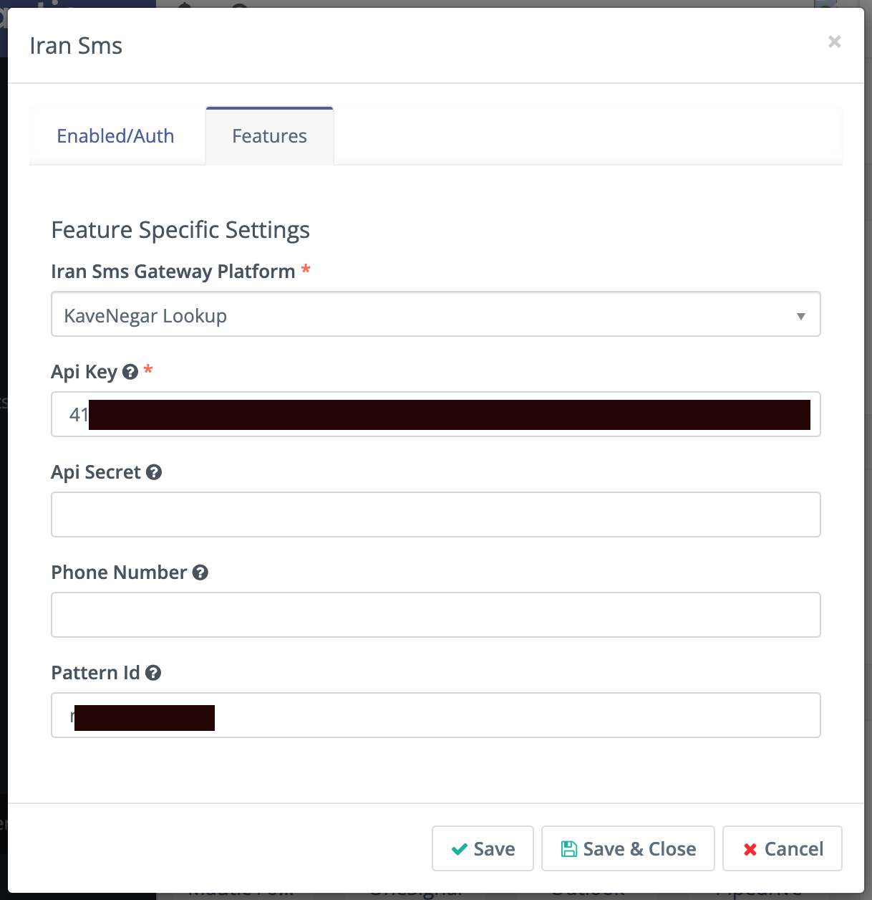
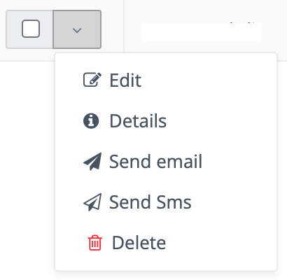

# Mautic Iranian SMS Providers Transport
### Read this in [Farsi](/README.fa.md)

## Available SMS Gateways
* [FarazSMS](https://farazsms.com/)
* [MizbanSMS](https://www.my.mizbansms.ir/)
* [Farapayamak](https://farapayamak.ir/)
* [Kavenegar](https://kavenegar.com/)
* [SmsIr](https://sms.ir/)

## Requirements
* Mautic 4
* An account in one of sms providers

## Install
1. Install plugin files
    * Clone this repo in mautic plugin directory instalation:
        1. ``git clone --depth 1 --branch master https://github.com/roghumi/IrSmsBundle /var/www/mautic/plugins/IrSmsBundle``
    * or [Download master branch](https://github.com/roghumi/IrSmsBundle/archive/refs/heads/main.zip) and unzip it in your mautic plugin directory with name ``IrSmsBundle``
1. Run mautic update
    * php bin/console mautic:plugin:install
1. Publish plugin in plugins dir
    * In features tab configure which provider you want to use and set credentials for it
1. Check that your default transport is irsms in mautic sms configuration
1. Now you can
    * Create Sms Message templates
    * Send Sms message in campaigns
    * Send Sms message directory to a contact

## Limitations:
* No bulk sending to the gateway Api
* 1 Sms provider can be configured for your whole mautic installation

## Contact
> If you need an improved version with multiple providers or bulk sending contact me on
* website: [https://roghumi.com](https://roghumi.com/en)
* email: [github@roghumi.com](mailto:github@roghumi.com)
* telegram: [@roghumi](https://telegram.me/roghumi)

## License: MIT
